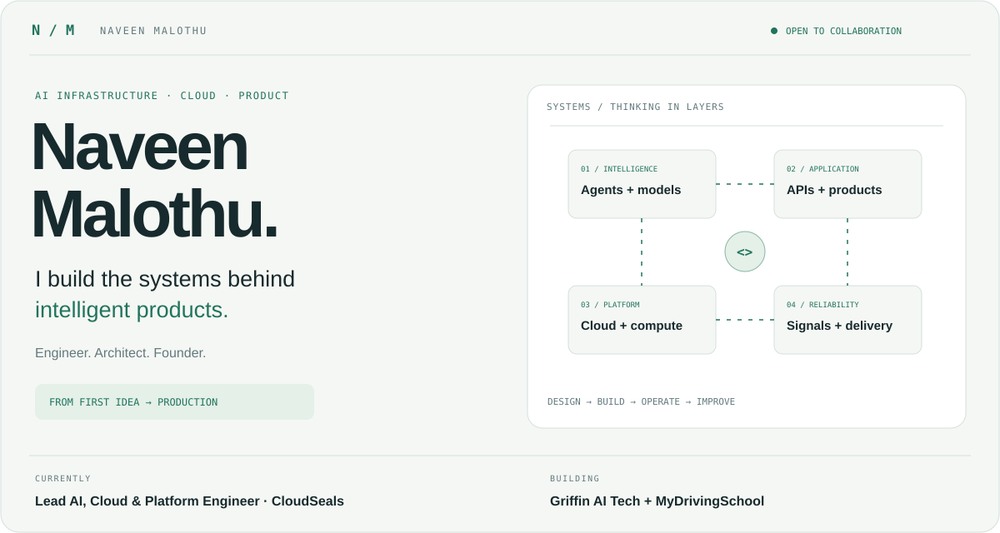
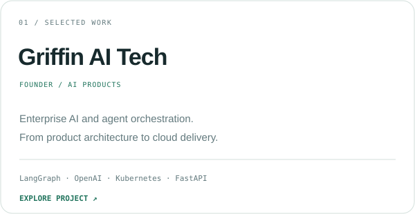
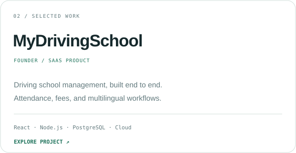
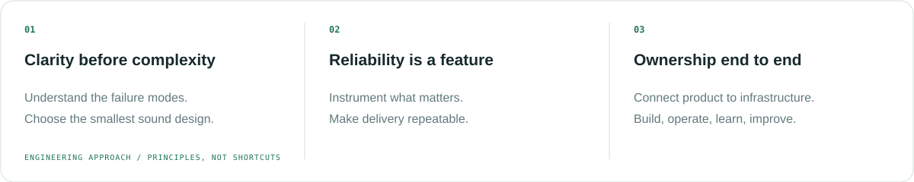
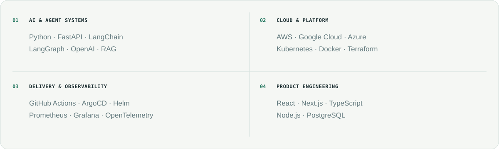

<picture>
  <source media="(prefers-color-scheme: dark)" srcset="assets/engineer-dark.svg">
  <source media="(prefers-color-scheme: light)" srcset="assets/engineer-light.svg">
  
</picture>

  <a href="https://naveenmalothu.com"><strong>Portfolio ↗</strong></a> &nbsp; / &nbsp;
  <a href="https://linkedin.com/in/naveen-malothu"><strong>LinkedIn ↗</strong></a> &nbsp; / &nbsp;
  <a href="mailto:admin@naveenmalothu.com"><strong>Start a conversation ↗</strong></a>

### Engineering where AI, infrastructure, and product meet.

I'm **Naveen Malothu**, an AI Infrastructure Engineer and DevOps Architect. At **CloudSeals**, I lead AI, Cloud & Platform Engineering: production AI systems, cloud-native services, infrastructure as code, and delivery pipelines.

I also founded **[Griffin AI Tech](https://griffinaitech.com)** and **[MyDrivingSchool](https://mydrivingschool.in)**. I enjoy owning the whole journey — understanding the problem, designing the system, shipping the product, and keeping it dependable.

### Selected work

<a href="https://griffinaitech.com"><picture><source media="(prefers-color-scheme: dark)" srcset="assets/griffin-dark.svg"><source media="(prefers-color-scheme: light)" srcset="assets/griffin-light.svg"></picture></a>
<a href="https://mydrivingschool.in"><picture><source media="(prefers-color-scheme: dark)" srcset="assets/driving-dark.svg"><source media="(prefers-color-scheme: light)" srcset="assets/driving-light.svg"></picture></a>

[Explore my work and experience ↗](https://naveenmalothu.com) · [Portfolio source ↗](https://github.com/MalothuNaveen/naveen-portfolio-website)

### How I think about engineering

<picture>
  <source media="(prefers-color-scheme: dark)" srcset="assets/principles-dark.svg">
  <source media="(prefers-color-scheme: light)" srcset="assets/principles-light.svg">
  
</picture>

I care about the decisions behind a system as much as the code inside it: clear boundaries, understandable failure modes, observable behavior, and a delivery process the team can trust.

### Tools I ship with

<picture>
  <source media="(prefers-color-scheme: dark)" srcset="assets/toolkit-dark.svg">
  <source media="(prefers-color-scheme: light)" srcset="assets/toolkit-light.svg">
  
</picture>

### Let’s build something that lasts.

An ambitious product, a challenging infrastructure problem, or a team that needs a builder — **[let’s talk](mailto:admin@naveenmalothu.com)**.

Open to **engineering roles · consulting · collaborations**. Based in **India**, working **remotely**.

---

Thoughtful systems. Useful products. End-to-end ownership.

