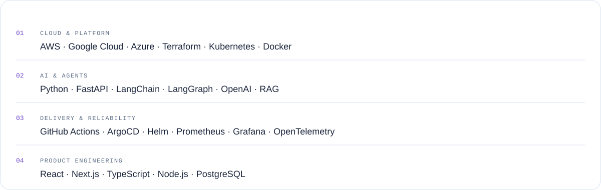

<picture>
  <source media="(prefers-color-scheme: dark)" srcset="assets/profile-dark.svg">
  <source media="(prefers-color-scheme: light)" srcset="assets/profile-light.svg">
  
</picture>

  <a href="https://naveenmalothu.com"><strong>Portfolio ↗</strong></a> &nbsp; · &nbsp;
  <a href="https://linkedin.com/in/naveen-malothu">LinkedIn</a> &nbsp; · &nbsp;
  <a href="mailto:admin@naveenmalothu.com">Let’s build something</a>

### The person behind the systems

I'm **Naveen**, an AI Infrastructure Engineer and DevOps Architect. I turn complex problems into dependable cloud-native systems and AI-powered products.

- **At CloudSeals:** leading AI, Cloud & Platform Engineering — from infrastructure as code and delivery pipelines to production AI systems.
- **As a founder:** building [Griffin AI Tech](https://griffinaitech.com) and [MyDrivingSchool](https://mydrivingschool.in), owning the journey from architecture to launch.
- **What I care about:** useful products, reliable infrastructure, and making the complicated feel simple.
- **Open to:** engineering roles, consulting, and thoughtful collaborations. Based in India; comfortable working remotely.

### My toolkit

<picture>
  <source media="(prefers-color-scheme: dark)" srcset="assets/stack-dark.svg">
  <source media="(prefers-color-scheme: light)" srcset="assets/stack-light.svg">
  
</picture>

### Selected work

| Project | What I’m building | Explore |
| :--- | :--- | :--- |
| **Griffin AI Tech** | Enterprise AI products, agent orchestration, and cloud-native infrastructure. | [Website ↗](https://griffinaitech.com) |
| **MyDrivingSchool** | Driving school management with attendance, fee tracking, and multilingual workflows. | [Website ↗](https://mydrivingschool.in) |
| **Portfolio** | My work, experience, and approach to building products and platforms. | [Live ↗](https://naveenmalothu.com) · [Source ↗](https://github.com/MalothuNaveen/naveen-portfolio-website) |

### Let’s make something useful

Have an ambitious idea or a tricky infrastructure challenge? [Email me](mailto:admin@naveenmalothu.com) or [connect on LinkedIn](https://linkedin.com/in/naveen-malothu).

---

Build with curiosity. Ship with intention.

